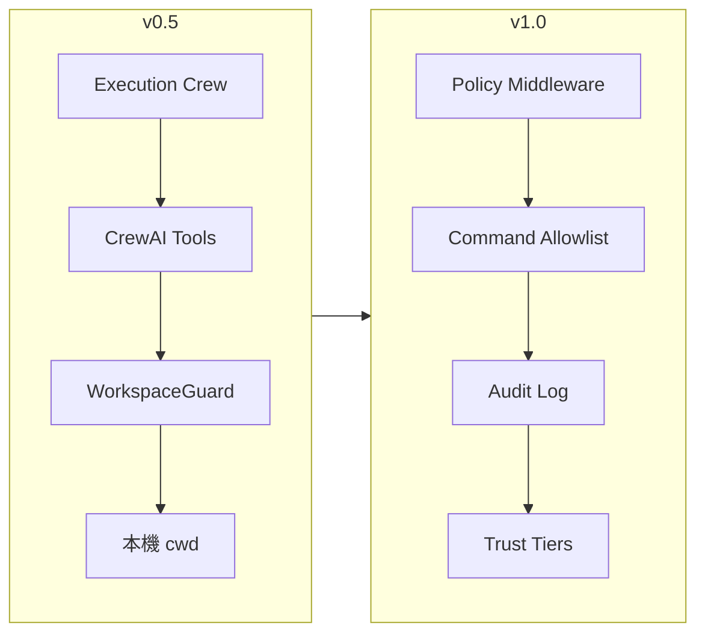

# Council Agent Roadmap

本文件記錄 Council Agent 的發展路線圖。策略採用 **Tool-First 漸進式**：先讓 Execution Crew 透過 CrewAI tools 在本機工作區動手操作，安全機制於 v0.6 起逐步補強，v1.0 完成完整信任框架。

> **開發方式**：所有版本里程碑的實作，皆採 **Spec-driven Development** 並搭配 [OpenSpec](https://github.com/Fission-AI/OpenSpec)。每個 feature 分支應對應一個 OpenSpec change，詳見 [AGENTS.md](AGENTS.md)。

## 現況（v0.9.5）

| 能力 | 狀態 |
|------|------|
| 三階段管線（Planning → Execution → Verification → Escalation） | ✅ |
| OpenRouter + YAML Preset | ✅ |
| Typer CLI | ✅ |
| Tool 基礎層（read/write/list/delete/run_command） | ✅ |
| WorkspaceGuard 邊界防護（filesystem 路徑；shell 僅驗證 cwd） | ⚠️ |
| `run_tests` + 結構化 pytest 報告 | ✅ |
| Tool 呼叫追蹤與 `max_tool_calls` 上限 | ✅ |
| Verification 讀取 tool 執行摘要 | ✅ |
| Execution Crew 掛載 tools | ✅ |
| `council sandbox` CLI（init / status / `--workspace`） | ✅ |
| Session 紀錄（`.council/sessions/`） | ✅ |
| 指令分類（read / write / dangerous） | ✅ |
| 互動確認（`--yes`／TTY ask／無 TTY refuse） | ✅ |
| 審計日誌（`.council/audit/` + `council audit show`／`export`） | ✅ |
| 政策設定檔（`council.policy.yaml`） | ✅ |
| Trust Tier | ❌（v1.0） |

v0.9 已發佈：可選專案根目錄 `council.policy.yaml` 自訂允許／拒絕指令 pattern 與額外敏感路徑；`run_command` 與 `WorkspaceGuard` 會套用政策。指令分類、互動確認與審計能力保留；Trust Tier 與完整 Policy Middleware 見 v1.0。

> **v1.0 準備（2026-08-11）**：進入 Trust Tier 前須先以 **v0.9.1–v0.9.9** 清債。詳見 [docs/releases/major-release-prep-playbook.md](docs/releases/major-release-prep-playbook.md)、[docs/releases/v1.0-alpha-known-issues.md](docs/releases/v1.0-alpha-known-issues.md)。  
> 已知限制：shell 非 OS sandbox；classifier 未知指令 fail-open 為 `read`；ConfirmMode ≠ Trust Tier；audit 無 hash chain／secret redaction；project policy 位於 Agent 可寫路徑。

## 目標里程碑

### v0.5 — 本機 Sandbox 與檔案操作

使用者可在**當前目錄**啟動 sandbox，Agent 能建立、修改、刪除檔案，並執行測試（如 pytest）。Verification 可參考真實測試結果，而非僅靠 LLM 自評。

### v1.0 — 完整信任與安全機制

具備指令授權防護、信任階梯、政策設定、審計日誌等安全基礎設施，在開放工具能力的同時維持可控風險。

## 策略說明：Tool-First



**核心原則**

1. **最小改動**：沿用現有 Orchestrator 與三階段管線，在 Execution Crew 掛載 tools。
2. **邊界先行**：所有檔案與指令操作經 `WorkspaceGuard` 驗證，限制在當前工作目錄內。
3. **安全外掛**：v0.5 先求功能可用；v0.6 起以 middleware 補強，避免阻塞主線開發。
4. **證據導向校驗**：Verification 逐步改為讀取 tool 回傳的結構化結果（exit code、stdout、檔案 diff）。

## 版本規劃

### v0.2 — Tool 基礎層

**目標**：建立可重用的 tool 實作，尚未掛載至 Execution Crew。

| 項目 | 說明 |
|------|------|
| `read_file` | 讀取工作區內檔案內容 |
| `write_file` | 建立或覆寫檔案 |
| `list_dir` | 列出目錄內容 |
| `delete_file` | 刪除檔案 |
| `run_command` | 執行 shell 指令，回傳 exit code + stdout/stderr |

**交付物**

- `src/council_agent/tools/` 模組
- 各 tool 的單元測試（使用暫存目錄）
- Tool 回傳統一的 `ToolResult` 結構（success、output、error、metadata）

**建議分支**：`feature/tools`

---

### v0.3 — Workspace 邊界

**目標**：所有 tool 操作限制在當前工作目錄（cwd）內，阻擋路徑穿越與敏感檔案。

| 項目 | 說明 |
|------|------|
| `WorkspaceGuard` | 解析並驗證路徑，確保 `realpath` 落在 workspace root 內 |
| 路徑穿越防護 | 拒絕 `../`、symlink 逃逸 |
| 敏感檔案黑名單 | 預設拒絕 `.env`、`.git/`、`.council/secrets/` 等 |
| 設定項 | `COUNCIL_WORKSPACE_ROOT`（預設 cwd） |

**交付物**

- `src/council_agent/sandbox/workspace.py`
- 路徑驗證單元測試（含 symlink、穿越攻擊案例）
- `.env.example` 新增相關環境變數說明

**建議分支**：`feature/workspace-guard`

---

### v0.4 — 測試整合

**目標**：Agent 可執行測試，Verification 能讀取真實結果。

| 項目 | 說明 |
|------|------|
| `run_tests` tool | 封裝 `pytest`（可指定路徑、額外參數） |
| 結構化測試報告 | 回傳 passed / failed / skipped 計數與失敗摘要 |
| Verification 升級 | prompt 調整：要求對照測試 exit code 與計劃中的成功標準 |
| `max_tool_calls` | 限制單次 run 的 tool 呼叫次數，防止迴圈失控 |

**交付物**

- `src/council_agent/tools/shell.py`（`run_command`、`run_tests`）
- Orchestrator / Verification 傳遞 tool 執行摘要
- 整合測試：mock LLM + 真實 tool 執行

**建議分支**：`feature/test-integration`

---

### v0.5 — Sandbox MVP

**目標**：在當前目錄建立 sandbox，Execution Crew 可完整 CRUD 檔案並跑測試。

| 項目 | 說明 |
|------|------|
| `council sandbox init` | 在 cwd 建立 `.council/` 工作區（設定、session 紀錄） |
| `council sandbox status` | 顯示工作區根目錄、已追蹤檔案、最近操作 |
| Execution Crew 掛載 tools | Planning 產計劃 → Execution 透過 tools 實際動手 → Verification 驗證 |
| Session 紀錄 | `.council/sessions/<id>/` 保存 tool 呼叫日誌（JSONL） |
| CLI 旗標 | `--workspace <path>` 指定工作區根目錄 |

**`.council/` 目錄結構**

```
.council/
├── config.yaml        # 工作區設定（root、黑名單擴充等）
└── sessions/
    └── <session-id>/
        ├── meta.json  # 時間、prompt、preset
        └── tools.jsonl
```

**CLI 範例（v0.5 目標體驗）**

```bash
# 在目前專案目錄初始化 sandbox
uv run council sandbox init

# 帶 tools 執行完整管線
uv run council run "為 utils.py 補上測試並確保 pytest 通過" --verbose

# 查看本次 session 的 tool 操作紀錄
uv run council sandbox status
```

**交付物**

- `src/council_agent/sandbox/` 完整模組
- `council sandbox` CLI 子命令群
- Execution Crew 整合 tools
- README 更新：sandbox 使用說明
- 端對端測試：暫存專案目錄內完整 run

**建議分支**：`feature/sandbox-mvp` → `release/0.5.0`

**v0.5 完成定義（Definition of Done）**

- [x] 在任意 cwd 執行 `council sandbox init` 可建立 `.council/`
- [x] Agent 可建立、修改、刪除工作區內檔案
- [x] Agent 可執行 `pytest` 並取得真實結果
- [x] 路徑穿越與敏感檔案存取被阻擋
- [x] Verification 參考測試結果做出 PASS/FAIL 判斷
- [x] 單次 run 的 tool 呼叫有上限保護

---

### v0.6–v0.9 — 安全補強

**目標**：在 v0.5 功能穩定後，逐步補上政策與審計，為 v1.0 鋪路。

#### v0.6 — 指令分類

| 分類 | 範例 | 預設行為 |
|------|------|----------|
| `read` | `cat`, `ls`, `pytest --collect-only` | 允許 |
| `write` | 建立/修改檔案 | 允許（工作區內） |
| `dangerous` | `rm -rf`, `curl`, `sudo`, `chmod` | 拒絕或需確認 |

- `src/council_agent/security/classifier.py`：指令 pattern 比對
- `run_command` 執行前經分類器檢查

#### v0.7 — 互動式確認

- 危險或邊界操作觸發 Rich TUI 確認（`[Y/n]`）
- `--yes` 旗標跳過確認（供 CI 使用）
- 無 TTY 環境預設拒絕危險操作

#### v0.8 — 審計日誌

- 所有 tool 呼叫寫入結構化 audit log
- `council audit show` / `council audit export`
- 日誌包含：時間戳、tool 名稱、參數、結果、呼叫者（session id）

#### v0.9 — 政策設定檔

- `council.policy.yaml`：自訂允許/拒絕的指令 pattern、敏感路徑
- Pydantic 驗證政策結構
- 專案根目錄政策覆蓋預設值

**建議分支**：`feature/security-classifier` → `feature/security-confirm` → `feature/audit` → `feature/policy`

---

### v0.9.1–v0.9.9 — v1.0 前清債（一版一主要問題）

**目標**：在實作 Trust Tier 前，關閉與 v1.0 DoD 衝突的 P0／P1。每個 patch **只解一個主要問題**；Trust Tier runtime 留給 v1.0-alpha。

| 版本 | 主要問題 | 驗收焦點 |
|------|----------|----------|
| v0.9.1 | Shell containment（含 classifier fail-open、`run_tests` quoting） | 未知／混淆指令 fail-closed；shell 不可藉「read」越界 |
| v0.9.2 | 唯一 Policy Middleware／dispatcher + `SecurityContext` | 所有產品 tool 路徑無旁路；統一決策與 audit 關聯 |
| v0.9.3 | 政策 trust boundary + versioned schema fail-fast | project policy 只能縮權；未知安全欄位 fail-fast |
| v0.9.4 | Audit integrity substrate | 控制面保護、redaction、sequence；Agent 不可竄改 |
| v0.9.5 | Principal／API Key scope 模型 | 區分 provider key 與授權 principal／scopes |
| v0.9.6 | Session authentication foundation | 高權限 step-up；`--yes` ≠ 認證 |
| v0.9.7 | User-owned trust grant store | grants 在 workspace 外；可 revoke |
| v0.9.8 | Trust Tier decision matrix（與 ConfirmMode 分離） | 決策表可測；不啟用 Tier runtime |
| v0.9.9 | Verification／escalation evidence closure + 文件校正 | escalation 後重新驗證；宣稱與邊界一致 |

**v1.0-alpha 准入**：v0.9.1–v0.9.9 全數發佈；已知問題清單中 P0／P1 已關閉並有證據；`./scripts/check.sh` 通過；真人與 Agent 測試手冊已走通。

**v1.0-beta 准入**：alpha 功能完成並 archive；P0 全關；公開測試文件就緒；公告固定 beta tag／commit。

準備文件：[`docs/releases/major-release-prep-playbook.md`](docs/releases/major-release-prep-playbook.md)、[`docs/releases/learning-log-v1-prep.md`](docs/releases/learning-log-v1-prep.md)、[`docs/testing/`](docs/testing/)。

**Non-goals（本清債序列）**：不實作 Trust Tier 0/1/2 對外行為、不以 `--yes` 充當 Tier 2、不宣稱完整 OS sandbox（除非該版明確交付）。

---

### v1.0 — 信任框架

**目標**：完整信任機制、指令授權防護與認證。**僅在 v0.9.x 清債完成後**於 v1.0-alpha 實作。

| 項目 | 說明 |
|------|------|
| **Trust Tier** | 0 = 所有操作需確認；1 = 安全指令自動執行；2 = 全自動（需明確啟用） |
| **`council trust`** | `grant` / `revoke` / `list` 管理指令授權 |
| **Policy Middleware** | 所有 tool 呼叫經統一 middleware：分類 → 政策 → 信任 → 審計 → 執行 |
| **API Key 分級** | 設定檔支援唯讀金鑰（僅 read tools）vs 完整金鑰 |
| **Session 認證** | 高權限操作（Tier 2、危險指令）需本機 passphrase 或 token 解鎖 |
| **完整性** | Audit log hash chain，防止事後篡改 |

**`council.policy.yaml` 範例**

```yaml
trust_tier: 1

allowed_commands:
  - "pytest *"
  - "python -m pytest *"
  - "uv run pytest *"

denied_commands:
  - "rm -rf *"
  - "curl *"
  - "sudo *"

denied_paths:
  - ".env"
  - ".git/**"
  - "**/secrets/**"

max_tool_calls: 50
```

**CLI 範例（v1.0 目標體驗）**

```bash
# 查看目前信任設定
uv run council trust list

# 授權 pytest 相關指令自動執行（Tier 1）
uv run council trust grant "pytest *"

# 以 Tier 0 執行（每個寫入操作都需確認）
uv run council run "重構 auth 模組" --trust-tier 0
```

**v1.0 完成定義（Definition of Done）**

- [ ] Trust Tier 0/1/2 可設定且行為符合預期
- [ ] `council trust grant/revoke` 可管理指令授權
- [ ] 所有 tool 呼叫經 Policy Middleware，無繞過路徑
- [ ] 審計日誌完整、可匯出、具 hash chain
- [ ] 危險指令預設拒絕，敏感路徑無法存取
- [ ] 高權限操作需額外認證解鎖
- [ ] 文件完整：安全模型說明、政策設定指南、威脅模型簡述

**建議分支**：`feature/trust-framework` → `release/1.0.0`

## 目標架構（v0.5 → v1.0）

```
src/council_agent/
├── cli.py
├── orchestrator.py
├── types.py
├── config/
│   ├── settings.py
│   └── presets.py
├── crews/
│   ├── base.py
│   ├── planning.py
│   ├── execution.py      # v0.5：掛載 tools
│   └── verification.py   # v0.4+：讀取 tool 結果
├── llm/
│   └── openrouter.py
├── tools/                # v0.2 新增
│   ├── base.py           # ToolResult、共用介面
│   ├── filesystem.py     # read / write / list / delete
│   └── shell.py          # run_command / run_tests
├── sandbox/              # v0.3–v0.5 新增
│   ├── workspace.py      # WorkspaceGuard
│   └── session.py        # session 管理與紀錄
└── security/             # v0.6–v1.0 新增
    ├── classifier.py     # 指令分類
    ├── policy.py         # 政策載入與驗證
    ├── middleware.py     # 統一攔截層
    ├── trust.py          # Trust Tier 與 grant 管理
    └── audit.py          # 審計日誌
```

## Tool 介面規格

所有 tools 回傳統一結構，供 Verification 與審計使用：

```python
@dataclass
class ToolResult:
    success: bool
    output: str
    error: str | None = None
    metadata: dict[str, Any] = field(default_factory=dict)
    # metadata 範例：{"exit_code": 0, "files_changed": ["tests/test_utils.py"]}
```

| Tool | 參數 | 回傳 metadata |
|------|------|---------------|
| `read_file` | `path: str` | `size`, `encoding` |
| `write_file` | `path: str`, `content: str` | `bytes_written`, `created` |
| `list_dir` | `path: str` | `entries: list[str]` |
| `delete_file` | `path: str` | `deleted: bool` |
| `run_command` | `command: str`, `cwd: str \| None` | `exit_code`, `duration_ms` |
| `run_tests` | `path: str = "."`, `args: str = ""` | `exit_code`, `passed`, `failed`, `skipped` |

## 風險與緩解

| 風險 | 影響 | 緩解措施 | 處理版本 |
|------|------|----------|----------|
| LLM 路徑穿越（`../`、symlink） | 讀寫工作區外檔案 | `WorkspaceGuard` + `realpath` 驗證 | v0.3 |
| Tool 呼叫迴圈失控 | API 費用暴增、執行時間過長 | `max_tool_calls` 上限 | v0.4 |
| 危險指令執行（`rm -rf /`） | 系統損壞 | 指令分類 + 預設拒絕 | v0.6 |
| v0.5 安全空窗期 | 過度權限 | 文件警示：僅在信任專案目錄使用；儘快升級 v0.6+ | v0.5 |
| 跨平台差異（macOS / Linux） | 指令行為不一致 | 以 pytest 為主要測試目標；指令分類採 pattern 而非完整 shell 解析 | v0.4+ |
| Prompt injection 誘導執行 | 繞過政策 | 政策檢查在 tool 層（非 LLM 層）；審計可追溯 | v0.8–v1.0 |

## 測試策略

| 層級 | 範圍 | 版本 |
|------|------|------|
| 單元測試 | `WorkspaceGuard` 路徑驗證、tool 回傳格式、指令分類 | v0.2–v0.6 |
| 整合測試 | mock LLM + 真實 tool 在暫存目錄執行 | v0.4+ |
| 端對端測試 | 完整 `council run` 在暫存專案內 CRUD + pytest | v0.5 |
| 安全測試 | 路徑穿越、敏感檔案、危險指令拒絕 | v0.3, v0.6+ |
| 回歸測試 | 現有 orchestrator / preset 測試不受影響 | 全版本 |

## 開發順序建議

```
v0.1.0
  └─ … ► v0.9
           ├─ shell-containment ─────────► v0.9.1
           ├─ policy-middleware ─────────► v0.9.2
           ├─ policy-trust-boundary ─────► v0.9.3
           ├─ audit-integrity ───────────► v0.9.4
           ├─ principal-scope ───────────► v0.9.5
           ├─ session-auth ──────────────► v0.9.6
           ├─ trust-grant-store ─────────► v0.9.7
           ├─ trust-decision-matrix ─────► v0.9.8
           ├─ evidence-closure ──────────► v0.9.9
           └─ feature/trust-framework ───► v1.0-alpha → beta → GA
```

每個 feature 分支從 `develop` 分出，完成後以 `--no-ff` 合併回 `develop`。版本發布時從 `develop` 開 `release/<version>` 分支，合併至 `main` 並打 tag。

## 相關文件

- [README.md](README.md) — 專案介紹與使用方式
- [AGENTS.md](AGENTS.md) — Spec-driven 開發與 OpenSpec 工作流程
- [CONTRIBUTING.md](CONTRIBUTING.md) — 分支策略與 commit 規範

---

*最後更新：2026-08-11 · 策略：Tool-First 漸進式 · v0.9.x 清債後進入 v1.0-alpha · 開發方式：Spec-driven + OpenSpec*
